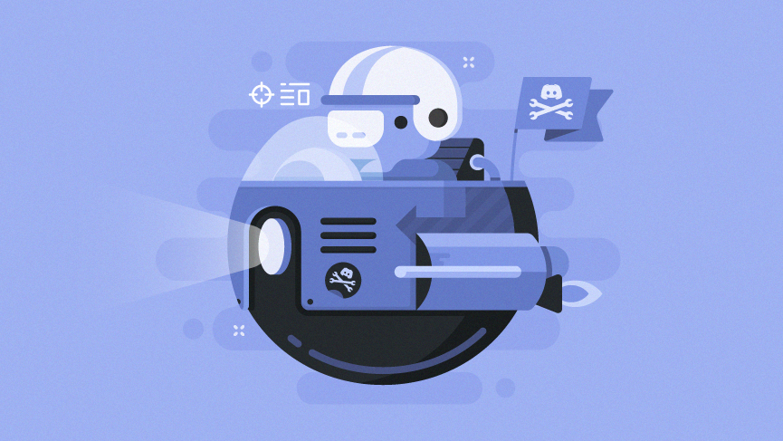
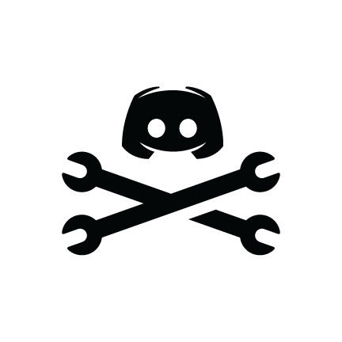

[**Invite**](https://discordapp.com/oauth2/authorize?client_id=446151195338473485&permissions=16&scope=bot) Viav to your server

## About

Viav is a minimalist, opinionated, voice channel management bot. To see what it's all about just add it to your server and join a voice channel. Viav doesn't store any user or server information locally, so you know you can trust it in your guild.

## Features

### Automatic Voice Channels

Always makes sure you have one available voice channel.

### A Text Channel for Every Voice Channel

Creates a text channel for every voice channel.

### Screen Sharing

Adds a link to the voice channel screen share in the text channel's topic.

## Running

```
npm i
```

### Development

```
TOKEN=<bot_token> npm run local
```

### Production

```
export TOKEN=<prod_bot_token>
npm run prod
```


